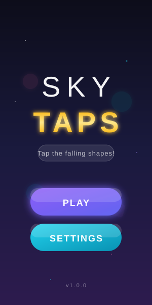
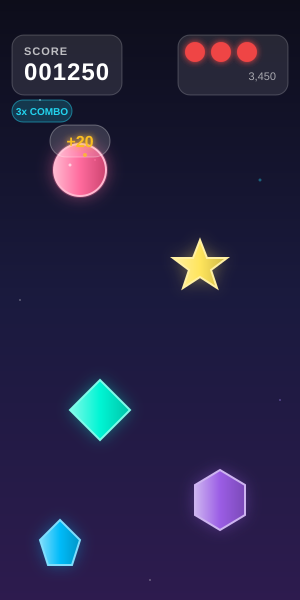
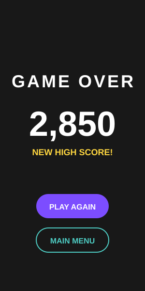
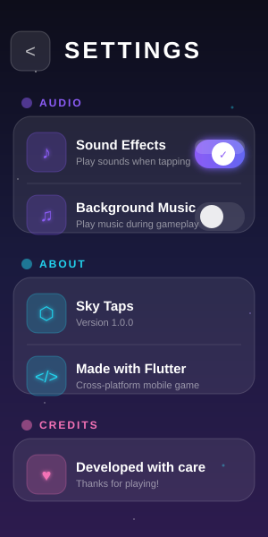

# Sky Taps

A premium, visually stunning tap-based mobile game built with Flutter. Tap falling geometric shapes before they hit the bottom of the screen in this addictive arcade experience.

## Screenshots

<p align="center">
  
  
  
</p>

<p align="center">
  
</p>

## Features

- **Premium Visual Design**: Modern glassmorphism UI with glow effects and smooth gradients
- **Particle Effects**: Explosion particles when tapping shapes, animated starfield background
- **7 Unique Shape Types**: Circles, squares, triangles, diamonds, stars, hexagons, and pentagons
- **Neon Color Palette**: Vibrant colors with outer glow and inner highlights
- **Combo System**: Build combos for score multipliers with visual feedback
- **Progressive Difficulty**: Game speed increases as you play
- **Animated UI**: Floating shapes on menu, pulsing buttons, smooth transitions
- **High Score Tracking**: Persistent high score with celebration effects
- **Lives System**: 3 lives with animated heart indicators
- **Settings**: Toggle sound effects and background music with premium switches

## How to Play

1. Tap **PLAY** from the main menu to start the game
2. Tap the falling shapes before they reach the bottom of the screen
3. Each shape is worth **10 points** + combo bonuses
4. Miss a shape and you lose a life
5. Lose all 3 lives and it's game over
6. Try to beat your high score!

## Game Mechanics

| Feature | Description |
|---------|-------------|
| Base Points | 10 points per tap |
| Combo Bonus | +5 points for each successive quick tap |
| Starting Lives | 3 |
| Difficulty | Increases over time (up to 3x speed) |

## Project Structure

```
lib/
├── main.dart              # App entry point
├── game/
│   ├── game.dart          # Game exports
│   └── game_engine.dart   # Core game logic
├── models/
│   ├── game_object.dart   # Falling shape model
│   ├── game_settings.dart # Settings model
│   ├── game_state.dart    # Game state management
│   └── models.dart        # Model exports
├── services/
│   ├── audio_service.dart    # Sound playback
│   ├── score_service.dart    # High score persistence
│   ├── settings_service.dart # Settings persistence
│   └── services.dart         # Service exports
└── ui/
    ├── screens/
    │   ├── game_screen.dart      # Main gameplay screen
    │   ├── main_menu_screen.dart # Start menu
    │   └── settings_screen.dart  # Settings page
    ├── theme/
    │   ├── app_colors.dart      # Color definitions
    │   ├── app_text_styles.dart # Typography
    │   └── app_theme.dart       # Theme configuration
    └── widgets/
        ├── animated_background.dart # Starfield background
        ├── game_button.dart         # Premium buttons
        ├── game_canvas.dart         # Game rendering surface
        ├── game_hud.dart            # Glassmorphism HUD
        ├── game_over_overlay.dart   # Confetti celebration
        ├── game_painter.dart        # Shape rendering with glow
        ├── life_indicator.dart      # Animated hearts
        ├── particle_system.dart     # Explosion effects
        ├── points_popup.dart        # Combo-aware score popup
        └── score_display.dart       # Gradient score text
```

## Getting Started

### Prerequisites

- Flutter SDK 3.0.0 or higher
- Dart SDK 3.0.0 or higher

### Installation

1. Clone the repository:
   ```bash
   git clone <repository-url>
   cd legendary-game
   ```

2. Install dependencies:
   ```bash
   flutter pub get
   ```

3. Run the app:
   ```bash
   flutter run
   ```

### Running Tests

```bash
flutter test
```

## Technologies Used

- **Flutter** - UI framework
- **Dart** - Programming language
- **shared_preferences** - Local storage for high scores and settings
- **CustomPaint** - Hardware-accelerated shape and particle rendering

## Color Palette

The game features a premium neon color palette with glow effects:

| Color | Hex | Usage |
|-------|-----|-------|
| Neon Pink | `#FF6B9D` | Shape color with glow |
| Neon Cyan | `#00F5D4` | Shape color, combo indicator |
| Neon Gold | `#FFE55C` | Star shapes, points popup |
| Neon Purple | `#9B5DE5` | Primary UI, hexagons |
| Neon Blue | `#00BBF9` | Pentagon shapes, accents |
| Neon Orange | `#FF9F1C` | Shape highlights |
| Neon Lime | `#B8FF57` | Shape highlights |

### Background Gradient

| Layer | Colors |
|-------|--------|
| Top | `#0D0D1A` Deep Space |
| Middle | `#1A1A3E` Midnight Blue |
| Bottom | `#2D1B4E` Deep Purple |

### UI Elements

| Element | Style |
|---------|-------|
| Panels | Glassmorphism with blur and transparency |
| Buttons | Gradient fill with outer glow |
| Text | Shader gradient from white to accent |
| Icons | Neon colors with subtle glow |

## License

This project is open source and available under the MIT License.

## Contributing

Contributions are welcome! Please feel free to submit a Pull Request.
